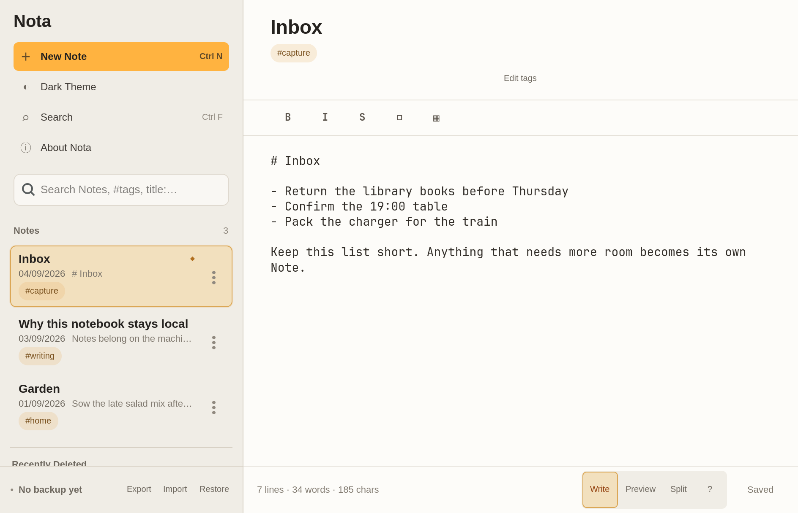
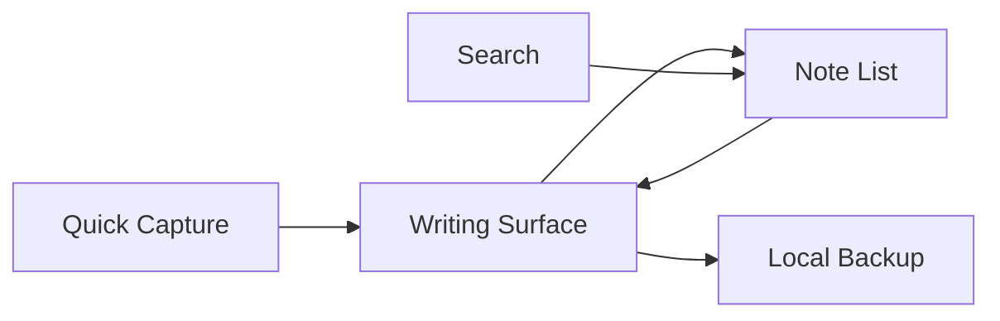

<p align="center">
  
</p>

<h1 align="center">Nota</h1>

<p align="center">
  A local-first Markdown note app for quick capture, focused writing,
  Search-led discovery, and user-owned Backup.
</p>

<p align="center">
  <a href="https://github.com/astrazds/nota/actions/workflows/ci.yml"></a>
  <a href="LICENSE"></a>
</p>

Nota is a Linux Markdown Note App. Create a Note quickly, stay oriented in a
Flat Collection, write without chrome getting in the way, preview Markdown when
you need it, recover accidental deletes, and export a Backup you own.

The post-1.0 product is the Relm4/GTK4 native window (`2.0.0-alpha.1`). This is
not a 2.0.0 release. The 1.0.2 Leptos browser app remains in-tree as a
migration Adapter until native cutover.

<p align="center">
  
</p>

## Why Nota?

A note app should feel like the Note was already waiting on your machine.
Nota keeps Notes in one Flat Collection and finds them with Search, the Note
List, and lightweight Tags. There are no folders, notebooks, or cloud sync.

Delete moves a Note to Recently Deleted so it can be restored. Backup is a
versioned local export. A Merge Import previews add/replace impact before it
changes the current collection.

## Install

Nota currently ships as source and as an x86_64 AppImage packager. The native
app needs [Rust](https://www.rust-lang.org/tools/install) 1.95 or newer and
GTK 4.22 or newer. Preview and Split also need the `webkitgtk-6.0` development
package.

```sh
git clone https://github.com/astrazds/nota.git
cd nota
cargo run -p nota-desktop
```

Enable Preview and Split with `--features preview-webkit`. Default
`cargo run -p nota-desktop` does not.

Collection data lives at `$XDG_DATA_HOME/net.astrazds.Nota` (typically
`~/.local/share/net.astrazds.Nota`). A first launch migrates
`net.astrazds.Noter` or a legacy `noter` directory when the canonical path is
absent.

### AppImage (alpha)

The first native distribution path wraps the Meson prefix (ADR-0010):

```sh
meson setup build --prefix=/usr --buildtype=release
meson compile -C build
DESTDIR="$PWD/build/AppDir" meson install -C build
python3 build-aux/package_appimage.py package build/AppDir --output dist/Nota-x86_64.AppImage
```

That packager downloads linuxdeploy tools on demand, bundles WebKitGTK 6
helpers, and verifies the AppDir contract. It is `2.0.0-alpha.1`, not a 2.0.0
release.

## Use

1. Create a Note from the sidebar, empty state, or `Ctrl+N`. Compact viewports
   return to the Writing Surface with the Note Title focused.
2. Write Markdown. Switch Write, Preview, or Split from the editor-area footer.
3. Find Notes with Search (`title:`, `tag:`, `is:pinned`, and quoted phrases
   are optional). Tags stay metadata, not primary navigation.
4. Export a Backup from the sidebar footer. Import shows add/replace impact
   before a Merge Import applies.



## Privacy

Nota has no backend, analytics, advertising, telemetry, or sync. Notes stay on
the device unless you export a Backup and choose to share that file.

| Location | Purpose |
| --- | --- |
| `$XDG_DATA_HOME/net.astrazds.Nota` | Native Notes, Recently Deleted, preferences, Backup Health |
| Browser LocalStorage (`nota-*`) | Migration Adapter only, on this machine |
| Backup JSON | User-owned local export / Merge Import |

See [PRIVACY.md](PRIVACY.md) for the complete data boundary.

## Limitations

- The native app is Linux-only. This is `2.0.0-alpha.1`, not a 2.0.0 release.
- Preview and Split need WebKitGTK 6. Default `cargo run` is Write-only.
- The first packaged artifact is an x86_64 AppImage. Flathub and other stores
  are not part of this repository yet.
- The Leptos browser Adapter is a migration source, not the product surface.

## Project structure

| Path | Purpose |
| --- | --- |
| `crates/nota-core/` | Notes, Search, Tags, Backup v1, Storage Recovery, Markdown |
| `crates/nota-desktop/` | Relm4/GTK4 native app, XDG store, AppImage payload |
| `src/` | Leptos browser Adapter until native cutover |
| `build-aux/` | Meson cargo wrapper and AppImage packager |
| `docs/` | Product, design, brand toolkit, and ADRs |
| `tests/` | Browser Playwright contracts and workflows |

Product language lives in [`CONTEXT.md`](CONTEXT.md). The register, visual
system, and brand rules are [`PRODUCT.md`](PRODUCT.md), [`DESIGN.md`](DESIGN.md),
and [`docs/brand-toolkit.md`](docs/brand-toolkit.md).

## Development

```sh
cargo fmt --check
cargo clippy --workspace --all-targets --all-features -- -D warnings
cargo test --workspace --all-features
cargo check --target wasm32-unknown-unknown --all-features
python3 build-aux/test_package_appimage.py
```

GitHub Actions runs formatting, `nota-core` tests, a wasm check, and the AppDir
contract, then a native job that installs GTK 4 / WebKitGTK 6 and runs the
workspace tests. Browser Playwright coverage (`npm ci`, `npx playwright install
chromium`, `npm run test:browser`) stays a local gate because Trunk has to emit
load-bearing CSS during startup.

Contributions are welcome; read [CONTRIBUTING.md](CONTRIBUTING.md) before
opening a pull request. Nota is licensed under [MIT](LICENSE).
