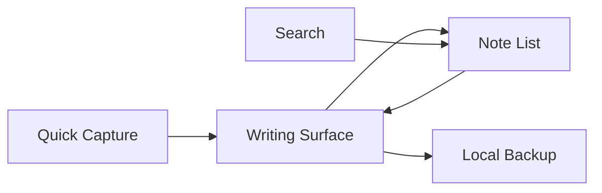

<p align="center">
  
</p>

<h1 align="center">Nota</h1>

<p align="center">
  A local-first Markdown note app for quick capture, focused writing,
  Search-led discovery, and user-owned Backup.
</p>

<p align="center">
  <a href="https://github.com/astrazds/nota/actions/workflows/ci.yml"></a>
  <a href="LICENSE"></a>
</p>

Nota is a Linux Markdown Note App. Create a Note quickly, stay oriented in a
Flat Collection, write without chrome getting in the way, preview Markdown when
you need it, recover accidental deletes, and export a Backup you own.

The Relm4/GTK4 native window is the only frontend in this source tree. The
native cutover is complete, but the crates remain at `2.0.0-alpha.1` until a
separate release. This source cutover does not publish a release or retire a
hosted browser app.

<p align="center">
  
</p>

## Why Nota?

A note app should feel like the Note was already waiting on your machine.
Nota keeps Notes in one Flat Collection and finds them with Search, the Note
List, and lightweight Tags. There are no folders, notebooks, or cloud sync.

Delete moves a Note to Recently Deleted so it can be restored. Backup is a
versioned local export. A Merge Import previews add/replace impact before it
changes the current collection.

## Install

Nota builds from source and can produce an x86_64 AppImage. The app needs
[Rust](https://www.rust-lang.org/tools/install) 1.95 or newer and GTK 4.22 or
newer. Preview and Split also need the `webkitgtk-6.0` development package.

```sh
git clone https://github.com/astrazds/nota.git
cd nota
mise run dev
```

Preview and Split are included by default. A write-only development build is
available with `--no-default-features --features gui`. Project tool versions
and common commands are defined in `mise.toml`.

Collection data lives at `$XDG_DATA_HOME/net.astrazds.Nota` (typically
`~/.local/share/net.astrazds.Nota`). A first launch migrates
`net.astrazds.Noter` or a legacy `noter` directory when the canonical path is
absent.

### AppImage (alpha)

The first native distribution path wraps the Meson prefix (ADR-0010):

```sh
mise run package:appimage
```

That packager downloads linuxdeploy tools on demand, bundles WebKitGTK 6
helpers, and verifies the AppDir contract. It is `2.0.0-alpha.1`, not a 2.0.0
release.

## Use

1. Create a Note from the sidebar, empty state, or `Ctrl+N`. Compact viewports
   return to the Writing Surface with the Note Title focused.
2. Write Markdown. Switch Write, Preview, or Split from the editor-area footer.
3. Find Notes with Search (`title:`, `tag:`, `is:pinned`, and quoted phrases
   are optional). Tags stay metadata, not primary navigation.
4. Export a Backup from the sidebar footer. Import shows add/replace impact
   before a Merge Import applies.



## Privacy

Nota has no backend, analytics, advertising, telemetry, or sync. Notes stay on
the device unless you export a Backup and choose to share that file.

| Location | Purpose |
| --- | --- |
| `$XDG_DATA_HOME/net.astrazds.Nota` | Native Notes, Recently Deleted, preferences, Backup Health |
| Browser LocalStorage (`nota-*`) | Legacy browser builds, local to that browser profile |
| Backup JSON | User-owned local export and Merge Import |

See [PRIVACY.md](PRIVACY.md) for the complete data boundary.

## Limitations

- The native app is Linux-only. This is `2.0.0-alpha.1`, not a 2.0.0 release.
- Preview and Split need WebKitGTK 6. Use `--no-default-features --features
  gui` for a write-only development build.
- The first packaged artifact is an x86_64 AppImage. Flathub and other stores
  are not part of this repository yet.
- This source cutover does not retire a hosted browser app.

## Project structure

| Path | Purpose |
| --- | --- |
| `crates/nota-core/` | Notes, Search, Tags, Backup v1, Storage Recovery, Markdown |
| `crates/nota-desktop/` | Relm4/GTK4 native app, XDG store, AppImage payload |
| `build-aux/` | Meson cargo wrapper and AppImage packager |
| `data/` | Desktop entry and AppStream metadata |
| `docs/` | Product, design, brand toolkit, and ADRs |

Product language lives in [`CONTEXT.md`](CONTEXT.md). The register, visual
system, and brand rules are [`PRODUCT.md`](PRODUCT.md), [`DESIGN.md`](DESIGN.md),
and [`docs/brand-toolkit.md`](docs/brand-toolkit.md).
Module ownership and workflow traces live in [the architecture map](docs/architecture.md).

## Development

```sh
mise install
mise run setup:rust
mise run verify
```

`mise run verify` runs formatting, Cargo checks, Clippy, workspace tests, and
the AppImage directory contract. Run `mise run test:gtk` separately on a live
display for GTK widget behavior. The [CI workflow](https://github.com/astrazds/nota/actions/workflows/ci.yml)
runs native tests and the GTK task under Xvfb in the
[gtk4-rs GTK 4 container](https://relm4.org/book/stable/continuous_integration.html).

Contributions are welcome; read [CONTRIBUTING.md](CONTRIBUTING.md) before
opening a pull request. Nota is licensed under [MIT](LICENSE).
