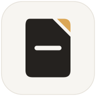
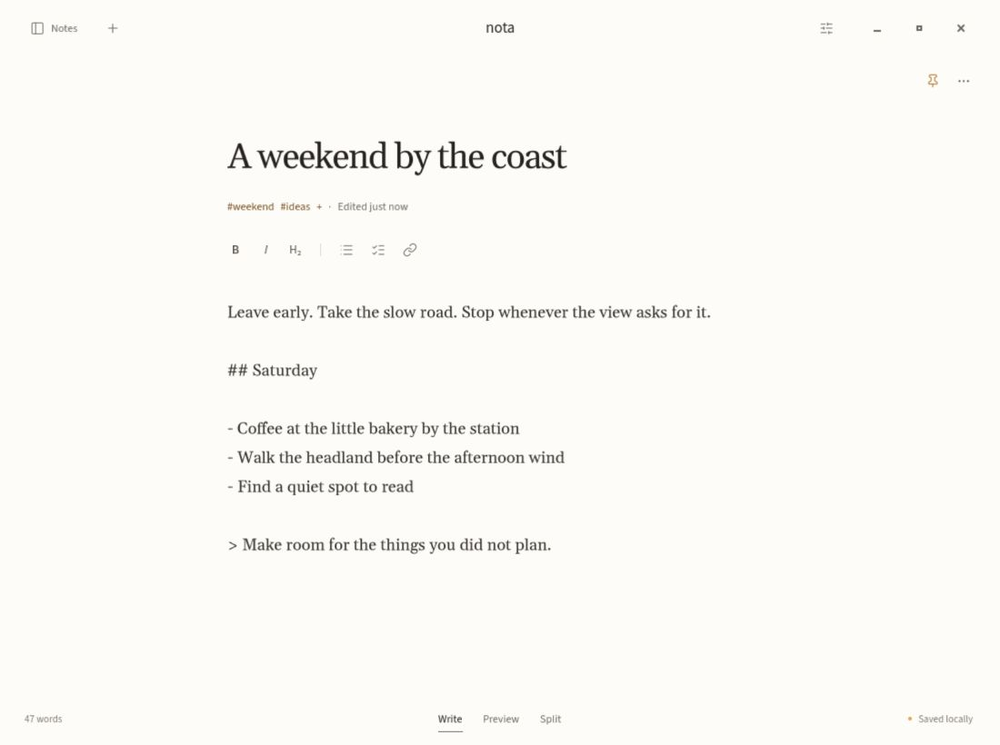
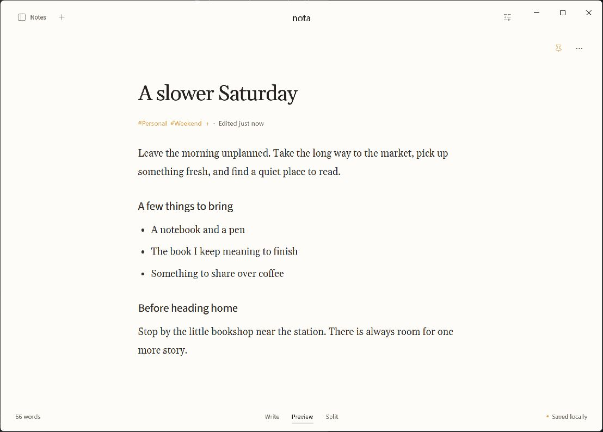

<p align="center">
  
</p>

<h1 align="center">Nota</h1>

<p align="center">Local-first Markdown notes for Linux and Windows.</p>

<p align="center">
  <a href="https://github.com/astrazds/nota/actions/workflows/ci.yml"></a>
  <a href="LICENSE"></a>
</p>

Write, read, and find your notes in one local collection. Nota has a centered
writing area, Markdown Preview, Search, Tags, pinned notes, and recoverable
deletion. Your notes stay on your computer. There are no accounts, telemetry,
or sync services.



The Linux app uses GTK4 and Relm4. The Windows app uses WinUI 3. Both share the
Rust note model, Markdown rendering rules, and storage formats.



These screenshots show the current Focus interface with synthetic notes.
[The screenshot gallery](docs/screenshots.md) includes more views and capture details.

## Run Nota

The current version is `2.0.0-alpha.1`. This is a native alpha, not a stable
release. Linux packaging targets an x86_64 AppImage. Windows packaging produces
an unsigned, self-contained x64 ZIP.

On Windows, download the `Nota-windows-x64` artifact from a successful
[CI run](https://github.com/astrazds/nota/actions/workflows/ci.yml).
Extract the workflow artifact, then extract the app ZIP inside it and run
`Nota.Windows.exe`. Keep its files together. Preview requires WebView2 Runtime.
See [the Windows guide](docs/windows.md) for prerequisites and limitations.

To build from source, install [mise](https://mise.jdx.dev/) and the platform
dependencies in [Contributing](CONTRIBUTING.md#prerequisites), then run:

```sh
git clone https://github.com/astrazds/nota.git
cd nota
mise install
mise run dev
```

`mise run dev` starts GTK on Linux and WinUI on Windows. Preview and Split are
included in the normal build. `mise.toml` pins Rust and the Windows .NET SDK.
Cargo declares Rust 1.95 as the minimum version.

On Linux, install the packaging prerequisites and build an AppImage:

```sh
mise run package:appimage
./dist/Nota-x86_64.AppImage
```

On Windows, build the self-contained ZIP:

```powershell
mise run package:windows
```

The Linux packager downloads linuxdeploy tools and bundles fonts and WebKitGTK
helpers. The Windows output is `dist/Nota-windows-x64.zip`. See
[the AppImage rehearsal](docs/agents/appimage-rehearsal.md) for package verification.

## Use your notebook

- Select **New note** or press `Ctrl+N` to start writing.
- Switch between **Write**, **Preview**, and **Split** in the footer. Split
  places the editor beside Preview in wide windows and stacks them in compact windows.
- Open **Notes** to search, filter by Tags, or select a pinned note. `Ctrl+F`
  opens the drawer and focuses Search. Queries support words, quoted phrases,
  `title:`, `tag:`, and `is:pinned`.
- Open **Settings** for Theme and Markdown help. **About Nota** is in the
  Notes drawer footer and also in Windows Settings.
- Expand **Recently deleted** in the Notes drawer to restore deleted notes.
- Open **Notes**, then **Backup**, to export or import a notes Backup.
  **Export complete notebook** also preserves Recently Deleted and Theme.

Notes save automatically. Existing collections open in Preview, and new notes
open in Write. The Notes drawer overlays the page without shifting the reading column.
[The user guide](docs/usage.md) explains editing, filtering, saving, backup
confirmation, and recovery.

## Keep your data

Linux stores data under `$XDG_DATA_HOME/net.astrazds.Nota`, normally
`~/.local/share/net.astrazds.Nota`. Windows uses
`%LOCALAPPDATA%\net.astrazds.Nota` and supports an isolated `--data-dir`.
Nota does not encrypt its collection or exported files.

Notes Backups merge into an existing collection. Complete-notebook exports
restore into an empty notebook on either platform. Backup v1 and
desktop-transition v1 remain compatible with legacy `noter.*` identifiers.
To migrate from a browser-era build, use a previously exported file. Native
Nota cannot read browser LocalStorage directly.

Preview blocks scripts, remote images, and network resource loads. Allowed
links you activate open through the system handler. Read
[Privacy](PRIVACY.md) for storage and network details, or
[Security](SECURITY.md) to report a vulnerability.

## Contribute

```sh
mise run setup:rust
mise run verify
```

Windows verification includes the WinUI build and C# checks against the actual
Rust library. Linux GTK editing and font checks need a display and run separately
with `mise run test:gtk` and `mise run test:gtk:fonts`.

[Contributing](CONTRIBUTING.md) covers feature checks, packaging, and pull request
evidence. [Documentation](docs/README.md) links the architecture, design,
domain reference, and historical decisions. Nota is licensed under [MIT](LICENSE).
