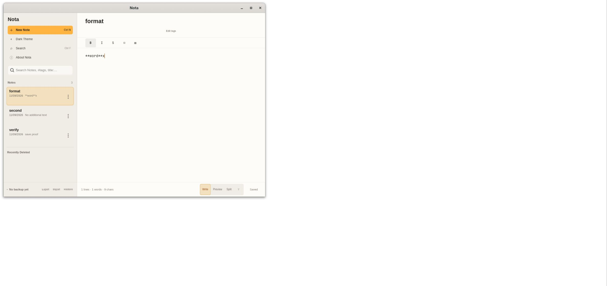
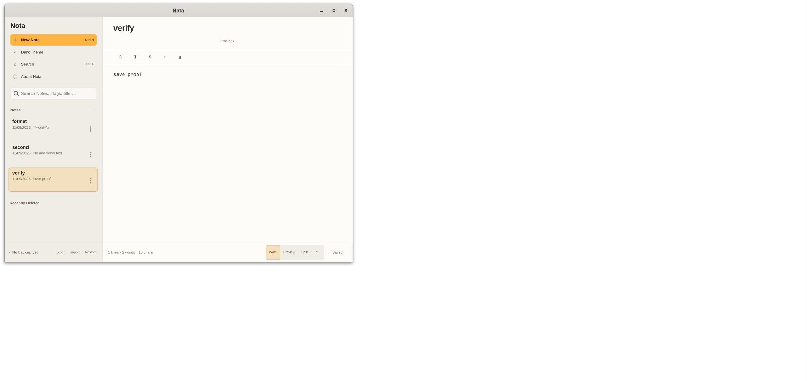

# Native verification skill evidence

The [verify-nota skill](../../.agents/skills/verify-nota/SKILL.md) was exercised
on 2026-09-11 against application revision
`23b5a2b1303d6cc00ec5c9ff4236683c4b33c393`. The publication changes add
documentation and screenshots only. This record describes that run, not a new
application test on the publication date.

## Procedure and results

The build command passed:

```sh
mise exec -- cargo build -p nota-desktop --features preview-webkit --locked
```

The run used GTK Broadway on loopback, a private D-Bus session, and disposable
HOME and XDG directories. Doctor verified the native executable, binary hash,
profile, and Broadway listener ownership before UI interaction.

| User action | Observed result |
| --- | --- |
| Create a Note from the Empty Collection | One Note appeared; an explicit title click was needed before text entry |
| Choose New Note in the sidebar | A second Note appeared and its title accepted keyboard input directly |
| Press Ctrl+N | A third Note appeared and its title accepted keyboard input directly |
| Enter title `verify` and body `save proof` | Title, body, sidebar snippet, and Saved status agreed |
| Select `word` and choose Bold | The body became `**word**` |
| Undo, redo, then type `x` | The body changed to `word`, then `**word**`, then `**word**x` |
| Close the native window and restart with the same profile | Exit status was zero; `verify` reopened with body `save proof` |
| Compare collection snapshots across restart | All three Note records, including their identities, were byte-identical |
| Close the app and stop Broadway | The app exited zero, its process and listener were gone, and the temporary profile was removed |

Nine screenshots and the collection snapshots survived cleanup in the local
evidence directory. Two synthetic screenshots are included below. Raw runtime
logs and machine-specific process receipts remain local.





## Coverage limits

This run proves the exercised writing paths. Automatic title focus on the
first Empty Collection creation remains unverified through Broadway. The
skill documents the explicit-focus fallback.

Broadway renders GTK controls into a canvas. Browser text filling did not
reach GTK, but individual key events did. Its browser accessibility tree
contained only the web area, and screenshots sometimes lagged input.

The runtime logged OpenGL fallback and isolated portal or AT-SPI warnings.
The run did not verify Wayland integration, GPU rendering, file pickers,
Preview, Split, AppImage packaging, or the other mapped features. Formatting
coverage was ASCII Bold, undo, redo, and subsequent insertion. It did not
cover Unicode, Italic, Strikethrough, task lists, or tables.
