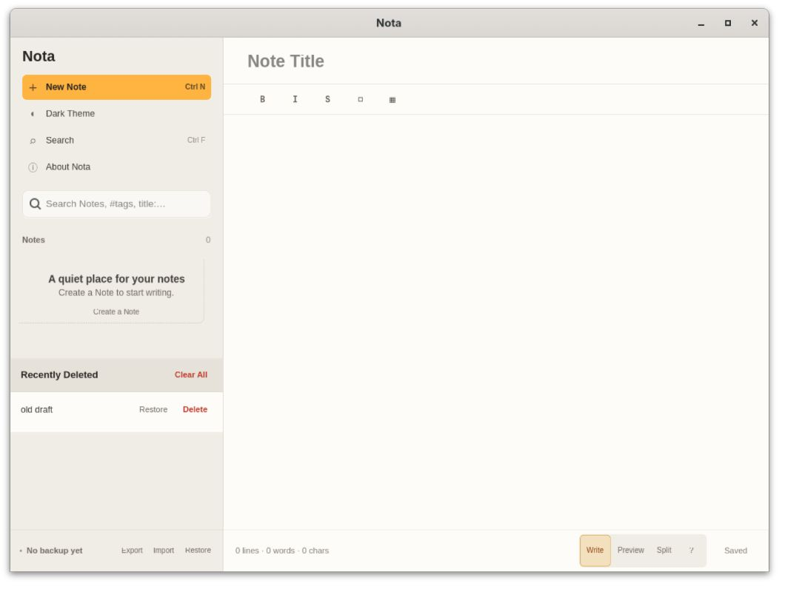
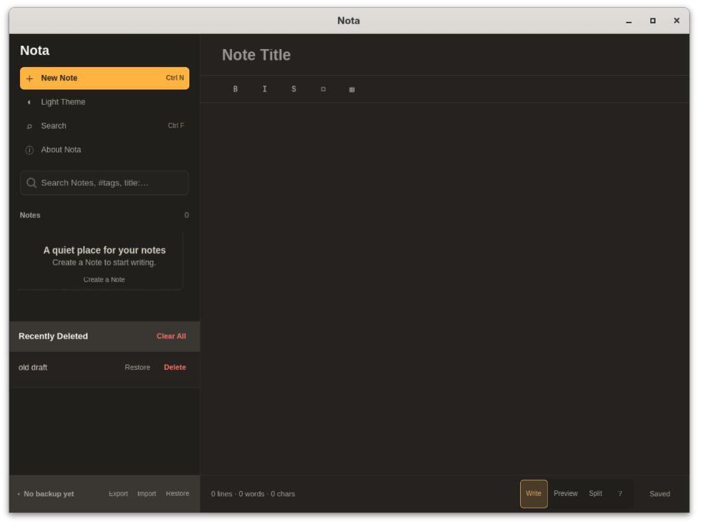

# Recently Deleted visual verification

The native GTK app was exercised on 2026-09-14 with the full-width Recently
Deleted section. The screenshots use synthetic notes created through the UI
in a disposable profile. They show the rebuilt application without external
CSS overrides.

The build passed with:

```sh
mise exec -- cargo build -p nota-desktop --features preview-webkit --locked
```

Before publication, the repository tasks `fmt`, `check`, `clippy`, `test`, and
`test:package` passed through mise. The Rust suites passed 171 tests, with one
display-dependent GTK test ignored by the default suite. The AppDir contract
suite passed all 11 tests.

## Observed results

- The section has a full-width header, a distinct background, and readable
  controls in both light and dark themes.
- Moving `old draft` to Recently Deleted preserved its identity and the body
  `save proof`.
- Clear All displayed the count of one deleted note and focused Cancel.
  Cancellation preserved the note.
- Restore returned the same note and text to the active collection.
- After the native window closed with exit status zero and the app restarted,
  the note reopened with the same text. The collection snapshots were
  byte-identical before and after restart.
- The runtime logs contained no GTK CSS parser warnings.





## Independent landing comparison

Before PR #6 merged, an independent verifier built and ran both application
revisions with the same synthetic fixture of two active and two deleted Notes:

- Base: `ed96a712bc6cb4d12e91641b89a33ccc6ffe0dd1`.
- Head: `f259b9ab62cb8fe63fd8eec0cd0da4fe594bcf8a`.

The new section was visibly distinct in both themes, including the separator
between deleted rows. Neither version showed clipping, overlap, or a GTK CSS
parser warning. Both native sessions exited cleanly, and their collection
files remained identical to the fixture. This comparison received a PASS
verdict; [PR #6](https://github.com/astrazds/nota/pull/6) merged as
`e226bf63b55f69dc2f27a2513d7c4b821d94c471`.

The [README screenshot](assets/readme/nota-main-window.jpg) comes from the head
comparison. The two screenshots above remain the original recovery smoke
captures. The PR's CI also passed its separate GTK editing workflow test.

## Coverage limits

The run used GTK Broadway. It does not establish Wayland integration, GPU
rendering, desktop portal behavior, or AppImage packaging. The isolated
runtime logged portal and accessibility service warnings.

The recovery smoke check used one deleted note; the independent landing
comparison covered two deleted rows. The landing comparison did not repeat
the recovery actions. Permanent Delete, confirmed Clear All, and cancellation
of the initial move were not exercised in either run.
