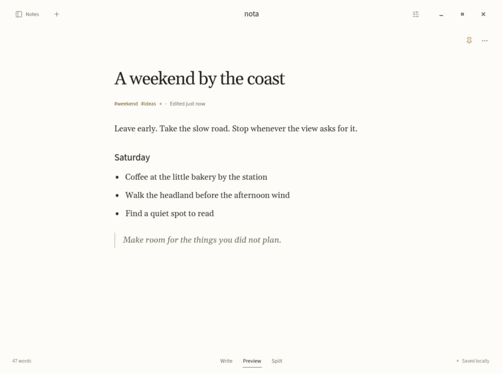
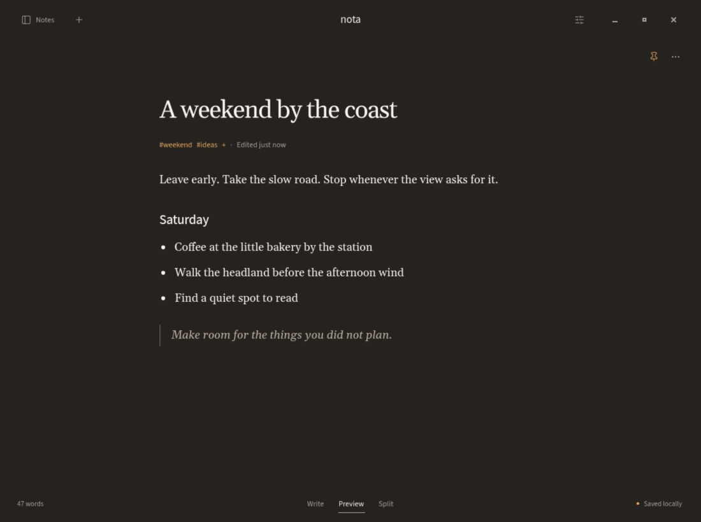
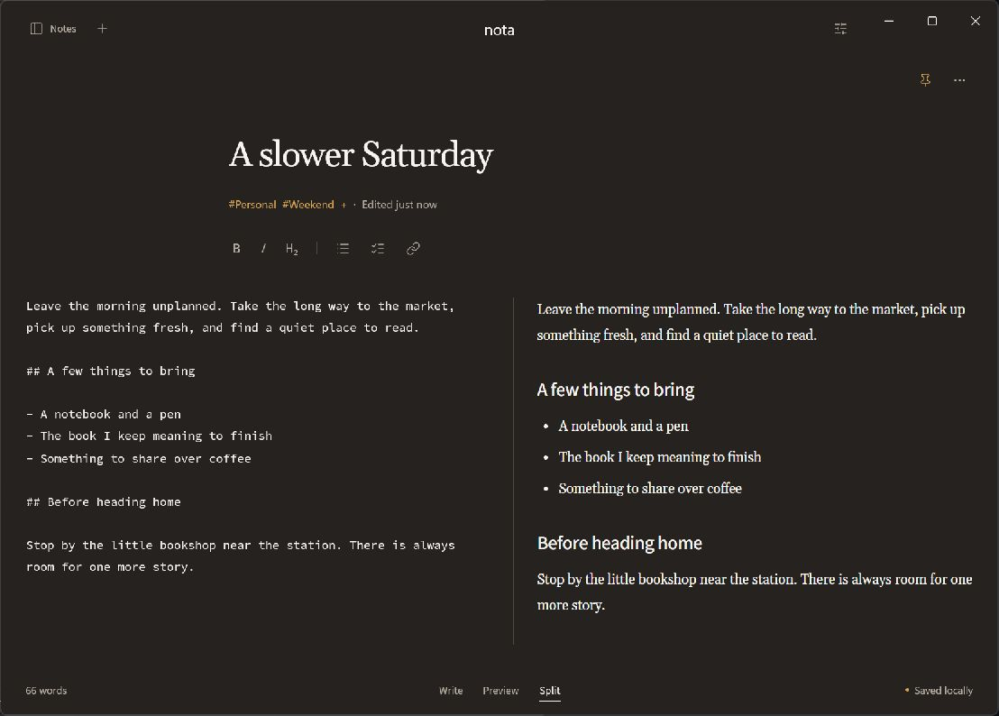

# Current screenshots

These captures show Nota's Focus interface on 6 October 2026. All notes are
synthetic. The images come from the running native apps, without pixel edits
or added frames.

## Linux

Write keeps the Markdown source in a centered reading column. Formatting
controls sit between the note metadata and body.

Preview renders the body below the same native title and Tags.

Dark Theme uses its own paper, text, and accent colors.

## Windows

The WinUI app shares the note model and rendered Markdown with Linux.

Split places a monospace Markdown editor beside the rendered body in wide windows.

## Capture details

Both apps were built from `f0768397459490e4e88e2a8be55a0ad35e59eabe`.
The Linux build preceded this update's package metadata edits. The Windows
captures include the metadata edits and corrected permanent-delete guidance.
The app version remains `2.0.0-alpha.1`.

Linux captures use the actual GTK app through Broadway in Ubuntu on WSL.
Each Linux JPEG is 1100 by 820 pixels. Windows captures are 1108 by 794 pixels
and use the native WinUI app and WebView2 on Windows 11. Both runs used isolated profiles with synthetic
`collection.json` fixtures. View and Theme changes used the visible app controls.

These images establish current appearance. Fixture setup does not test note
entry, and Broadway does not establish Wayland, GPU, or packaged AppImage behavior.
Earlier images in dated [Windows](windows-verification.md),
[writing](agents/verification-evidence.md), and
[Recently Deleted](recently-deleted-verification.md) records remain historical evidence.

To refresh the gallery, follow the [GTK verification procedure](../.agents/skills/verify-nota/SKILL.md)
or the [Windows isolation procedure](windows.md#keep-verification-separate-from-personal-notes).
Use a current build, synthetic notes, a private profile, and native controls.
Inspect the saved image for clipped content, open menus, and accidental personal data.
