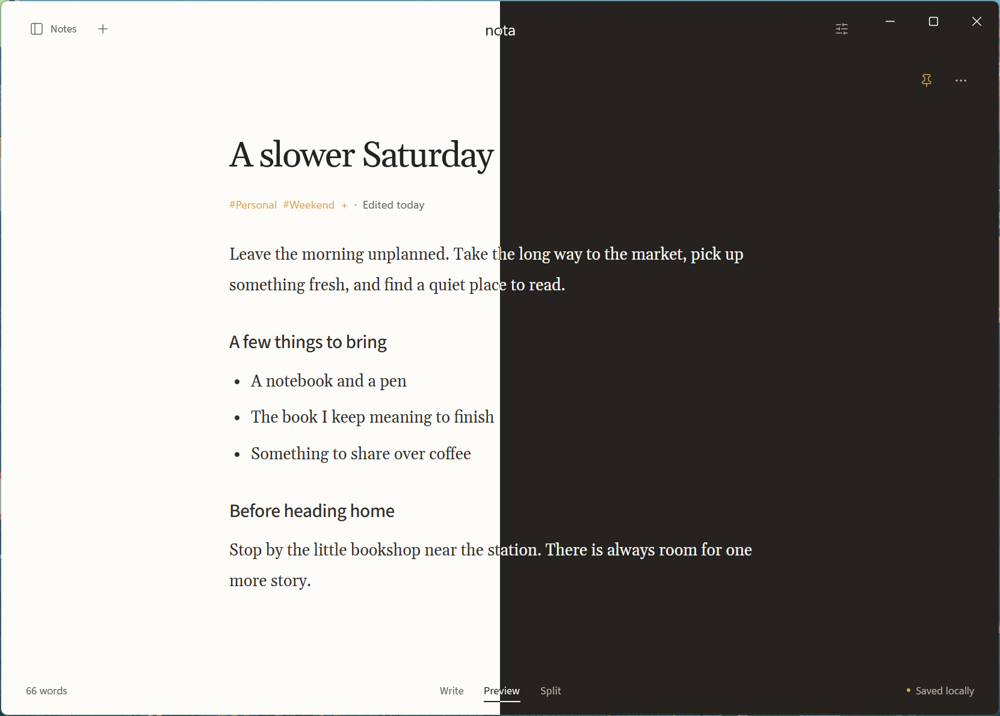

# Theme screenshot

This image shows Nota's Windows app on 6 October 2026, with Light Theme on
the left and Dark Theme on the right. It combines equal halves of two native
captures of the same note and view. Nota applies one theme to the whole window.

## Capture details

The captures use the native WinUI app and WebView2 on Windows 11, with an
isolated profile and synthetic notes. The app version is `2.0.0-alpha.1`.
Theme changes use the visible app controls.

The source captures and the composite are lossless PNG files at 1662 × 1191
pixels. The composite joins the left half of the Light capture to the right
half of the Dark capture without resizing either image.

This image records the Windows app's appearance. It does not verify note entry
or represent the Linux app's window controls.
Earlier images in dated [Windows](windows-verification.md),
[writing](agents/verification-evidence.md), and
[Recently Deleted](recently-deleted-verification.md) records remain historical evidence.

To refresh the image, follow the [Windows isolation procedure](windows.md#keep-verification-separate-from-personal-notes).
Use a current build, synthetic notes, a private profile, and native controls.
Capture the same note, view, window size, and scroll position in each theme.
Use Windows Alt+Print Screen and save the clipboard image directly as PNG.
Do not save a resized automation preview or convert it to JPEG.
Combine equal halves of the native captures without resizing.
Inspect the saved image for sharp text, clipped content, open
menus, and accidental personal data.
