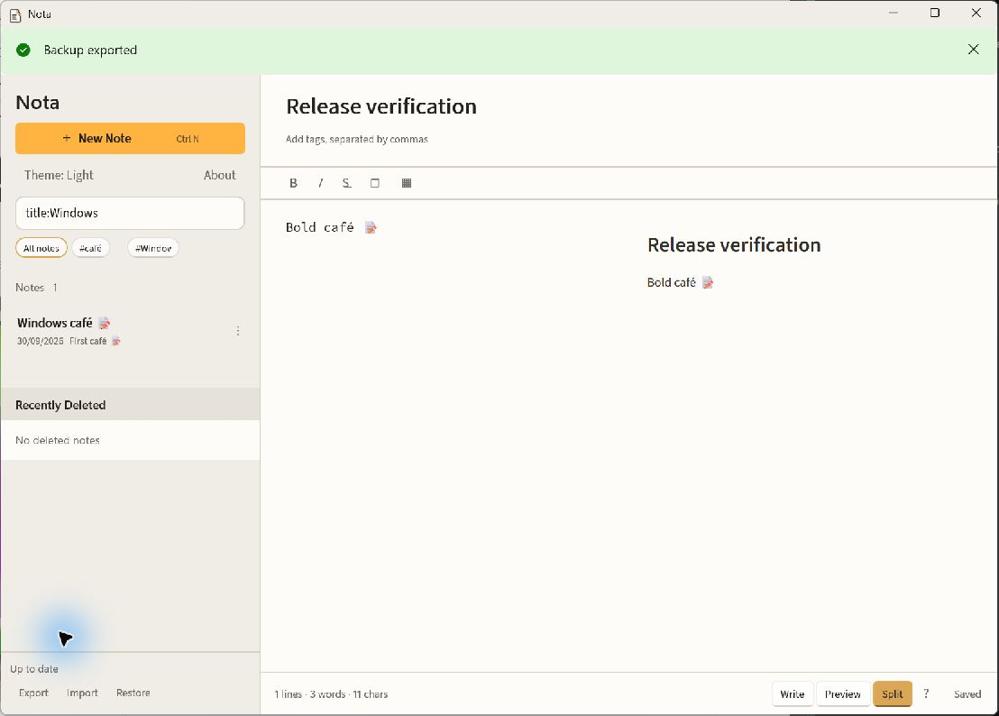
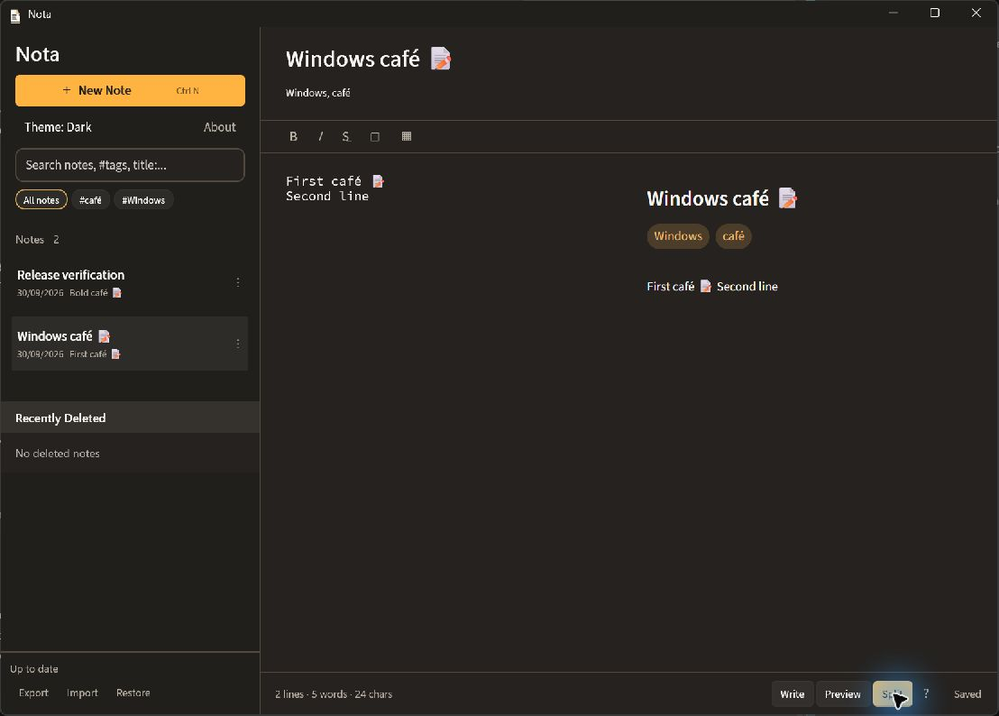
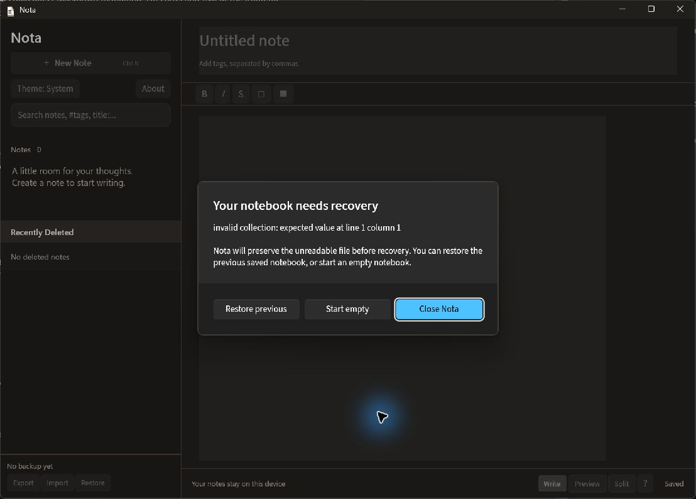

# Windows port verification

Verified on 30 September 2026 with Windows 11 x64 at 150% display scaling.
Linux checks used Ubuntu 26.04 under WSL, with GTK tests on Xvfb.

## Automated checks

- Windows `mise run verify`: formatting, Rust checks and strict Clippy, all portable Rust tests, and WinUI build passed. The build reported no warnings or errors.
- `mise run test:windows`: all 35 checks passed against the actual Rust DLL. Coverage includes Unicode, native CR/CRLF conversion, UTF-16 formatting offsets, explicit note identities, stale edits, merge import, transition restore, exclusive profile access, failed-save retry, recovery and corrupt-byte preservation.
- Linux `mise run verify`: full workspace checks, strict Clippy, tests and 11 AppImage contract tests passed.
- Linux `xvfb-run --auto-servernum mise run test:gtk`: the native formatting and undo workflow passed.
- GTK private D-Bus/Xvfb launch checks: five secondary launches exited successfully while the same primary remained responsive; normal primary-window close exited successfully and saved preferences. The former Relm4 runner hung on secondary exit on the baseline as well as the first port.

## Packaged Windows workflows

The app was published, zipped, extracted, and launched from the extracted directory with an isolated `--data-dir`. No personal notebook was opened.

- Created notes with Unicode titles, emoji, accented body text and Tags.
- Confirmed Ctrl+N focuses the new title and Ctrl+F focuses Search.
- Applied Bold with Ctrl+B and removed only the formatting with one Ctrl+Z.
- Verified `title:Windows` filters the note list, and checked Light and Dark Themes.
- Rendered generated Markdown in Split view through WebView2 with embedded fonts. Fixed the initial navigation policy to accept only the exact generated data document and its anchors.
- Exported through the Windows save picker and inspected Backup v1 contents and note identities. Backup Health changed only after the file was written.
- Closed and reopened the extracted app. The final comparison preserved the complete collection JSON, including note identities, body text, Tags and modification timestamps. Light Theme also survived.
- Opened a second isolated profile with a corrupt collection and a valid previous snapshot. The UI blocked ordinary editing, Restore previous recovered both Notes, and the quarantine file retained the exact corrupt bytes.

## Fixes found by live verification

XAML resources needed application scope before the root Grid loaded. Unpackaged publishing omitted the application PRI, so the project now explicitly includes it; see [WindowsAppSDK issue 6720](https://github.com/microsoft/WindowsAppSDK/issues/6720). Real Enter input supplied CR, so the frontend normalizes paragraphs at the Rust boundary. Delayed TextChanged events after loading were treated as edits; matching snapshots now leave modification timestamps intact.

## Limits

This is an unsigned x64 folder and ZIP, with no installer, updater, Store registration or ARM64 build. WebView2 Runtime must be present for Preview. Windows 10, ARM64, clean machines without build tools, screen readers, IME composition, live import confirmation, and every file-picker/recovery branch were not exercised manually. The DLL tests cover the underlying import and recovery behavior. GTK verification here does not establish Wayland/GPU behavior or live WebKit scroll stability.

## Design choices

Experience First led to native Windows controls and file pickers. Model the Domain kept note and persistence rules in one Rust Session. Laziness Protocol favored a small in-process ABI over process supervision. Prove It Works required extracted-package launch, real keyboard input, and file comparisons instead of relying on compilation alone. Separate Before Serializing Shared State gave implementation workers isolated worktrees; note requests themselves are serialized by the C# queue.
